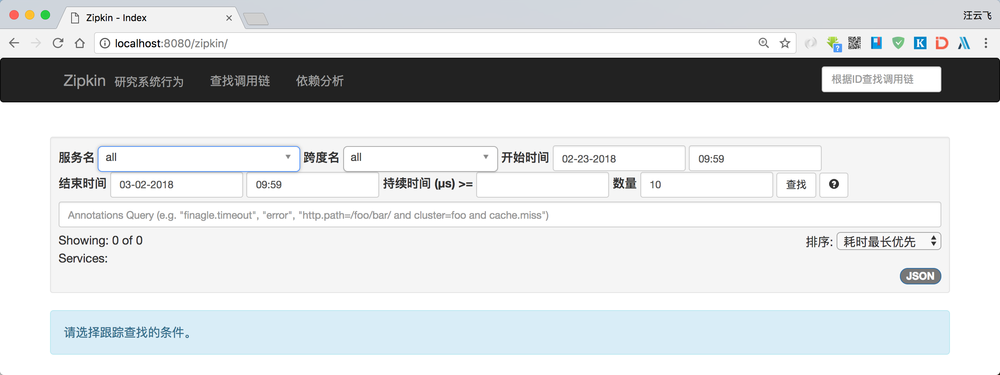
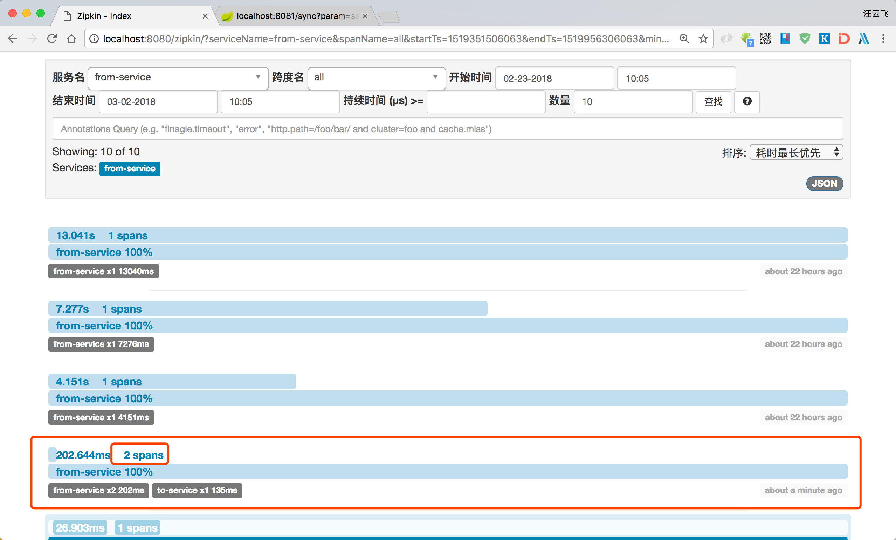
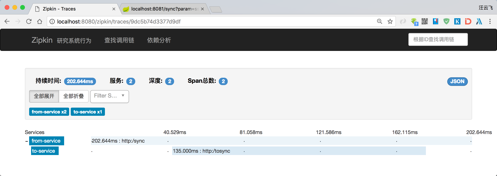
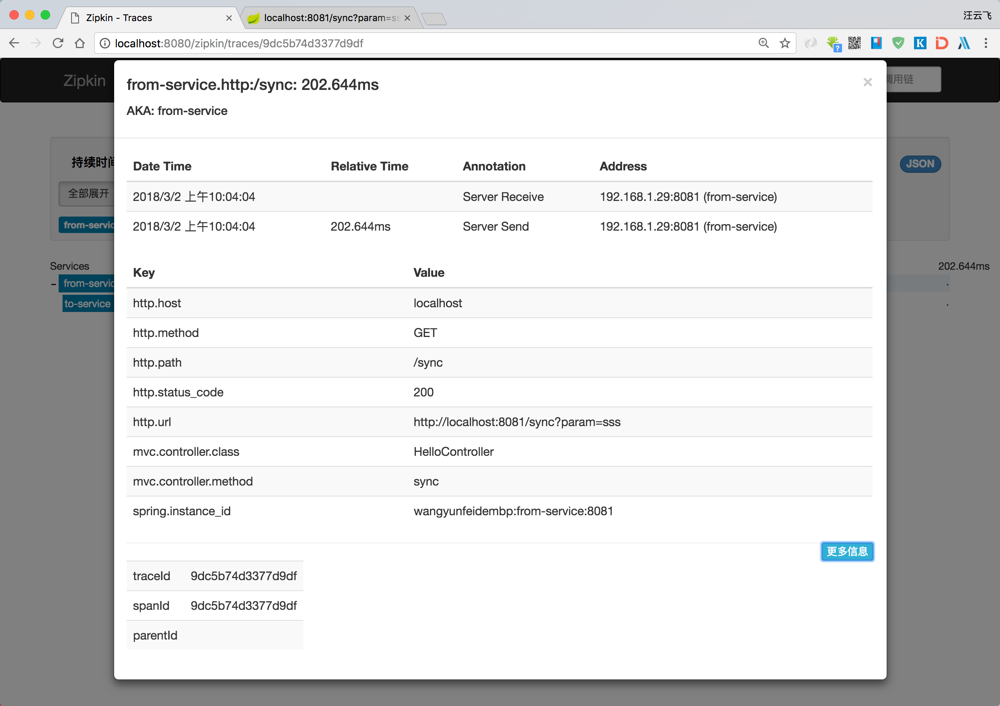

# 使用Spring Cloud Sleuth、Zipkin、kafka、Elasticsearch实现分布式追踪
本例使用`Spring Cloud Sleuth`来实现分布式追踪，利用`Kafka`实现异步的分布式追踪，使用`Elasticsearch`存储追踪数据，使用`Zipkin`查看追踪内容。

## 1.前置条件
使用`docker compose`安装`Kafka`和`Elasticsearch`：
### Kafka安装

```yaml
version: '2'

services:
  zk:
    image: wurstmeister/zookeeper
    ports:
      - "2181:2181"


  kafka:
    image: wurstmeister/kafka:0.10.1.1
    ports:
      - "9092:9092"
    environment:
      KAFKA_ADVERTISED_HOST_NAME: kafka
      KAFKA_ZOOKEEPER_CONNECT: zk:2181
    volumes:
      - /var/run/docker.sock:/var/run/docker.sock
```


### Elasticsearch安装

```
version: '2'

services:
  elasticsearch:
    image: registry.cn-hangzhou.aliyuncs.com/wiselyman/es553:5.5.3
    restart: on-failure
    ports:
      - '9200:9200'
      - '9300:9300'
```

> `registry.cn-hangzhou.aliyuncs.com/wiselyman/es553:5.5.3`是`docker.elastic.co/elasticsearch/elasticsearch:5.5.3`阿里云加速镜像

## 2.搭建Zipkin Server
### 依赖
```xml

<dependency>
	<groupId>org.springframework.cloud</groupId>
	<artifactId>spring-cloud-starter-sleuth</artifactId>
</dependency>

<dependency>
	<groupId>org.springframework.cloud</groupId>
	<artifactId>spring-cloud-sleuth-zipkin-stream</artifactId>
</dependency>

<dependency>
	<groupId>org.springframework.cloud</groupId>
	<artifactId>spring-cloud-stream-binder-kafka</artifactId>
</dependency>

<dependency>
	<groupId>io.zipkin.java</groupId>
	<artifactId>zipkin-autoconfigure-ui</artifactId>
</dependency>

<dependency>
	<groupId>io.zipkin.java</groupId>
	<artifactId>zipkin-autoconfigure-storage-elasticsearch-http</artifactId>
	<version>2.4.1</version>
</dependency>
```

### 3.开启Zipkin支持

```java
@SpringBootApplication
@EnableZipkinStreamServer
public class ZipkinServerApplication {

	public static void main(String[] args) {
		SpringApplication.run(ZipkinServerApplication.class, args);
	}
}
```

### 配置kafka

```java
spring.cloud.stream.kafka.binder.zkNodes: 192.168.1.222
spring.cloud.stream.kafka.binder.brokers: 192.168.1.222
```

### 配置ES存储

```java
zipkin:
  storage:
    type: elasticsearch
    elasticsearch:
      hosts: http://192.168.1.222:9200
      username: elastic
      password: changeme
      cluster: elasticsearch
      index: zipkin
      index-shards: 1
      index-replicas: 1
```

## 4.示例调用服务`from-service`

### 依赖

```xml
<dependency>
	<groupId>org.springframework.cloud</groupId>
	<artifactId>spring-cloud-starter-sleuth</artifactId>
</dependency>

<dependency>
	<groupId>org.springframework.cloud</groupId>
	<artifactId>spring-cloud-stream-binder-kafka</artifactId>
</dependency>

<dependency>
	<groupId>org.springframework.cloud</groupId>
	<artifactId>spring-cloud-sleuth-stream</artifactId>
</dependency>
```
### 配置
```yaml
spring.application.name: from-service
server.port: 8081

spring.sleuth.sampler.percentage: 1.0

spring.cloud.stream.kafka.binder.zkNodes: 192.168.1.222
spring.cloud.stream.kafka.binder.brokers: 192.168.1.222

```

### 调用控制器

```java
@RestController
public class HelloController {
    @Autowired
    RestTemplate restTemplate;
    @GetMapping("/sync")
    public String sync(@RequestParam String param){
        return restTemplate.getForObject("http://localhost:8082/toSync?param=" + param,String.class);
    }
}
```

## 5.示例被调用服务`to-service`
### 依赖

```xml
<dependency>
	<groupId>org.springframework.cloud</groupId>
	<artifactId>spring-cloud-starter-sleuth</artifactId>
</dependency>

<dependency>
	<groupId>org.springframework.cloud</groupId>
	<artifactId>spring-cloud-stream-binder-kafka</artifactId>
</dependency>

<dependency>
	<groupId>org.springframework.cloud</groupId>
	<artifactId>spring-cloud-sleuth-stream</artifactId>
</dependency>
```

### 配置

```yaml
spring.application.name: to-service
server.port: 8082

spring.sleuth.sampler.percentage: 1.0

spring.cloud.stream.kafka.binder.zkNodes: 192.168.1.222
spring.cloud.stream.kafka.binder.brokers: 192.168.1.222
```
## 演示
- 启动`zipkin-server`，访问zipkin页面`http://localhost:8080/zipkin/`:



- 启动`from-service`,`to-service`,访问`http://localhost:8081/sync?param=sss`，这时查看zipkin页面:






